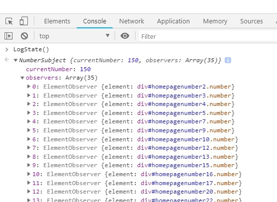

# Javascript observer pattern (ES6)

### Learn javascript observer pattern through this example.

#### 1. Increment - button updates Observable/Subject and notifies subscribed observers that a change has been made.
#### 2. Add Observer Element - button creates new element and subscribes it to Observable/Subject to be updated whenever a change happens.
#### 3. You can click on number displaying elements to unsubscribe from Observable/Subject.

#### Use LogState() in console to display details about Observable/Subject.

#### Meanwhile, while you are here, check out this cute NPM Package for serving static files from any folder/path on your filesystem:
https://github.com/indexzero/http-server

