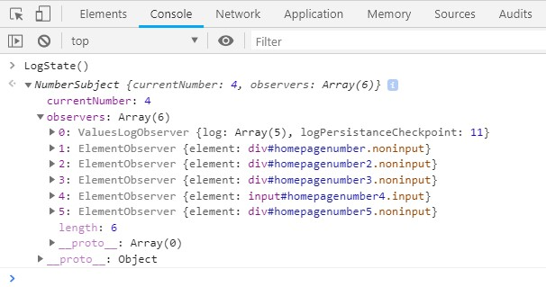

# Javascript observer pattern

### Learn javascript observer pattern through this example.

#### 1. Increment - button updates Subject and notifies subscribed observables that a change has been made.
#### 2. Add Observer Element of type non-input - button creates new element of type non-input (div) and subscribes it to Subject to be updated whenever a change happens.
#### 3. Add Observer Element of type input - button creates new element of type input with one way binding and subscribes it to Subject to be updated whenever a change happens.
#### 4. You can click on number displaying elements to unsubscribe from Subject.

#### Use LogState() in console to display details about Observable/Subject.

#### Non DOM Values log observer type persists values in console after every 10 values received.

#### Meanwhile, while you are here, check out this cute NPM Package for serving static files from any folder/path on your filesystem:
https://github.com/indexzero/http-server

