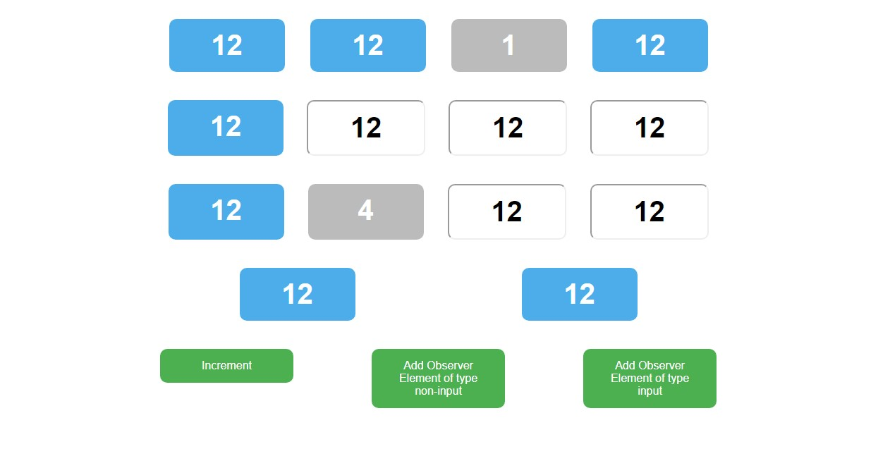

# Javascript observer pattern

### Learn javascript observer pattern through this example.

#### 1. Increment - button updates Subject and notifies subscribed observables that a change has been made.
#### 2. Add Observer Element - button creates new element and subscribes it to numberModel to be updated whenever a change happens.

#### You can click on number displaying elements to unsubscribe from Subject.

